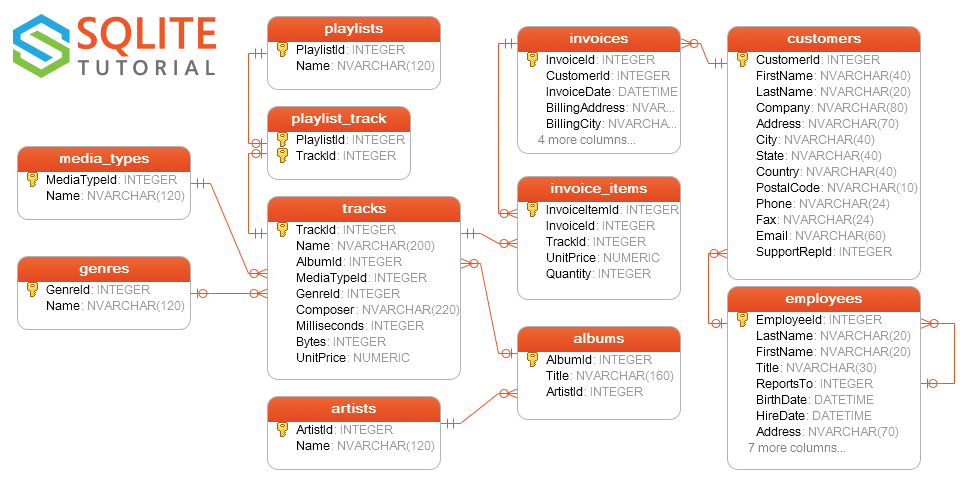

# CS 346 Assignment #5 - REST API
We finish our tour of network programming by climbing to the top of the Application layer by developing a REST API using .NET CORE MVC.  REST APIs have become the standard for interfacing with data-driven websites.  In this assignment, you will develop a REST API for the [chinook database created by SQLite Tutorial](https://www.sqlitetutorial.net/sqlite-sample-database/):



# Getting Started
Begin by creating a private repository in the course's [GitHub organization](https://github.com/HSU-F20-CS346).
Your repository name **__must__** be in the following format: ```p05-{HSU LOGIN}```.  Thus, my project repository
name would be ```p05-asc564```.  When creating your repository, be sure to initialize your repository with a readme
and add a VisualStudio .gitignore template.  License doesn't matter so much -- I typically choose Apache.  

Next, copy the [example code](https://github.com/HSU-F20-CS346/example-restapi) into your repository.  

Once created, your repository should have a "src" directory that contains your solution file and 
a project directory as well as a "tests" directory that contains an export of your Postman routes.     

## Required Utilities
* [Postman](https://www.postman.com/)
You will use Postman to create a series of requests to test your project.  

**__NOTICE:__** Failing to set up your repository correctly will result in reduced assignment credit.  

# Project Requirements
In order to receive full credit, your program must meet the following requirements.

## Requirements

### Endpoints for all database entities
Your REST API should expose CRUD (Create, Read, Update, Delete) operations for all database entities: media_types, genres, playlists, playlist_track, tracks, artists, invoices, invoice_items, albums, customers, employees.  My starter code already has an endpoint for artists which can serve as a foundation for the other entities.  Note that creating CRUD operations by hand is quite tedious; for this reason VS 2019 has an option to auto generate CRUD controllers based on a supplied data model.  Feel free to use this!  **NOTE:** I had to modify the auto-generated code a bit to get it working how I wanted.

### Search Functionality
Your REST API must also expose search functionality for artists, albums, and tracks.  In particular,

1. You should be able to search for an artist by genre or album title
2. You should be able to search albums by artist or genre
3. You should be able to search tracks by artist, album, artist, or genre

### Postman Test Cases
You need to supply Postman routes and test cases for each of the routes you developed for the Search Functionality requirement.  See the starter repository for how to set up tests.  I'll also cover this in class. 

## Advanced Requirements
Taking this project further may result in additional credit being given. 

# GitHub Workflow
I spent 100+ hours over the summer looking at git commits and github issues and learning about "good" github workflow.
I would like to incorporate what I learned into my teaching.  To that end, you should:

* Create up an "automated kanban" project board in github.
* Make cards for each project requirement, place them in the "To do" column.  
* When you begin working on a given requirement, drag the associated card to the "In progress" column and convert
the card into an issue
* After doing the initial commit that contains the starter code, all changes should be worked on in a separate branch
* Be sure to tag future commits with the issue number to which they correspond. 
* Once a feature is complete:
   * you should create a pull request to bring the new changes into the main branch.  
   * you close the issue by moving the card to the completed "Done" column in your project board.

## Tips on writing commit messages
Good commit messages should be atomic, accurate, precise and have a rationale:
* **__Atomic__**: Whether the commit focuses on a single concern.
* **__Accurate__**: Whether the commit message identifies exactly those changes that were made—no more, no fewer
* **__Precise__**: Whether the commit message unambiguously describes the changes that were made
* **__Rationale__**: Whether the commit message includes a rationale for the changes made. A best practice for providing such a rationale is to tag the issue or issues addressed by the commit. 

## Tips on writing issues
Good issues should be atomic, have a good title, and describe WHO, WHAT, and WHY. 
* **__Atomic__**: Issue focuses on exactly one concern. 
* **__Title__**: Issue title is short and descriptive.
* **__WHO__**: Issue identifies who is affected by the change. 
* **__WHAT__**: Issue describes what is being changed.  
* **__WHY__**: Issue provides a rationale for the code change. 

An easy way to hit all of this is to create issues whose title is in the following format:

```As a <User Type>, I can <Perform Action> so that <Reason why User Type would want to perform action>```

Example:

```As a IT administrator, I can scan a given port on a server so that I can tell whether or not a given service is running on that server.```

Additionally, acceptance criteria (how you know when the issue is done) should be provided in the issue's description. 
Acceptance criterial are ideally listed as checkboxes using brackets in markdown [].  Note that it is acceptable to create acceptance criteria as you
go alone.  Acceptance criteria themselves should be atomic. E.g. "Allow user to specify either TCP or UDP" is a good
acceptance criteria whereas "Complete basic project requirements" is not.  

Here's an example checklist in markdown

- [x] Task 1
- [ ] Task 2

Note that all checkboxes should be checked before closing an issue.

# Design Diary Prompt
Design diaries should be a paragraph or two.  You will be graded on content (i.e. it shows 
deep thought) rather than syntax (e.g. spelling) and structure.  Below are some prompts that can be used to get 
you thinking.  Feel free to use these or to make up your own.
* Describe a particular struggle that you overcame when working on this programming assignment.
* Conversely, describe an issue with your assignment that you were unable to resolve.
* Provide advice to a future student on how he or she might succeed on this assignment.
* Describe the most fun aspect of the assignment.
* Describe the most challenging aspect of the assignment.
* Describe the most difficult aspect of the assignment to understand.
* Provide any suggestions for improving the assignment in the future.

Your design diary will be submitted on canvas and **__should not__** be included in your repository.

# Buddy Report
You will be assigned one or two buddies at the beginning of the assignment.  You are **__not__**
responsible for your buddy's progress.  Rather, the purpose of this is to build your social 
circle and to to give you someone to check in with as you work on your project.  
Give your honest appraisal of each of your buddies' progress:

* Did they seem like they gave a good, honest effort?  
* Did they get stuck somewhere?
* What ideas were shared / what was discussed during your interactions?
* What did you learn from them?
* Anything else you want to add.

A report for each buddy only needs to be a paragraph.  This Buddy Progress Report is _*in no way*_ 
connected to your Buddy's grade.  It is, however, tied to your grade so be sure to provide an accurate report!

Your buddy report will be submitted on canvas and **__should not__** be included in your repository.

# Grading
* Completing the basic requirements, github workflow, design diary, and buddy report will result in full credit
* Completing one or more bonuses will result in extra credit if and only if all requirements 
have been implemented.  

# Due Date
The official deadline is Sunday, November 15, 2020 by midnight.  Submit your reflection and buddy report on Canvas.  Be sure to include a licecap demo of your project in the root of your repository.  Include a link in your main readme.md
